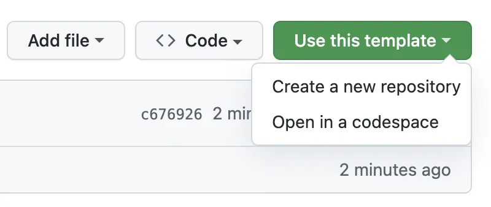
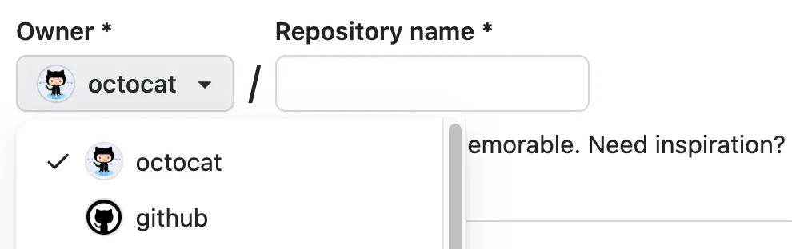

# TENK Tech Camp 2023 Frontend utvikling

Hei 😊 Så kjekt at du vil hjelpe oss med å bli ferdig med komponentene våre sånn at vi rekker tidsfristen. I denne filen står det litt om hva du trenger å gjøre for å komme i gang.

> [!NOTE]  
> For voksne: Se START_HER.md i dev-branchen for informasjon om hvordan det er tenkt å gjennomføre workshoppen. 

## Kopier koden til din egen Github konto

1. Klikk på **Use this template**
2. Velg **Create a new repository**

> [!NOTE]  
> Maja added content to alt tags so we follow the suggestions we ourselves will make in the workshop 😉
> Please check my Norwegian!

3. Bruk Owner dropdown menyen til å velge din egen konto

4. Gi repoet ditt navnet **brukernavn.github.io**, der du bytter ut «brukernavn» med brukernavnet ditt på Github.

5. Velg **Create repository from template**.

## Start utviklingsmiljøet ditt

Når vi skriver kode, så kan vi bruke en helt vanlig tekst-program – men det er bedre å bruke et program som er laget for å skrive kode, da får vi litt hjelp av programmet som f.eks. å passe på at vi ikke skriver kode på en feil måte, å forhåndsvise det vi lager i en nettleser og så videre.

En av de mest populære programmene man kan bruke er VS Code. Det kan man installere på maskinen sin, men det som er enda bedre å bruke noe som heter Codespaces. Da kan man skrive koden rett i nettleseren sin uten at man trenger å installere noe som helst. 

I dette repoet her har vi laget noen regler som gjør at alle sammen har det samme oppsettet uansett om man er på en Mac, PC eller Chromebook.

> [!IMPORTANT]  
> TODO: Hvordan starte Codespaces

## Last opp koden til repoet ditt

En ting som er viktig med Codespaces er å huske på at det er litt som å låne en PC av noen andre. Før du leverer den tilbake igjen må du ha overført filene dine til ditt eget område, ellers kan det hende du mister masse arbeid. 

> [!IMPORTANT]  
> TODO: Hvordan synke med Github

